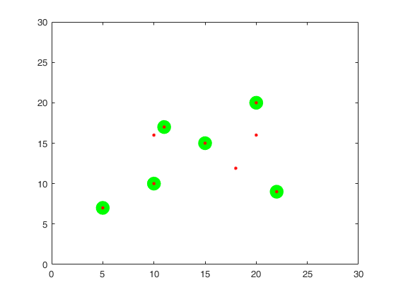

# SOM_Code

MATLAB Code of SOM (self-organizing maps) Neural Network Based Method for Task Assignment of Multi-Agent Systems

Authors: Xin Li

Email: lixin850224@163.com

Laboratory of Underwater Vehicles and Intelligent Systems

Shanghai Maritime University

<!-- more -->

<!--  -->

